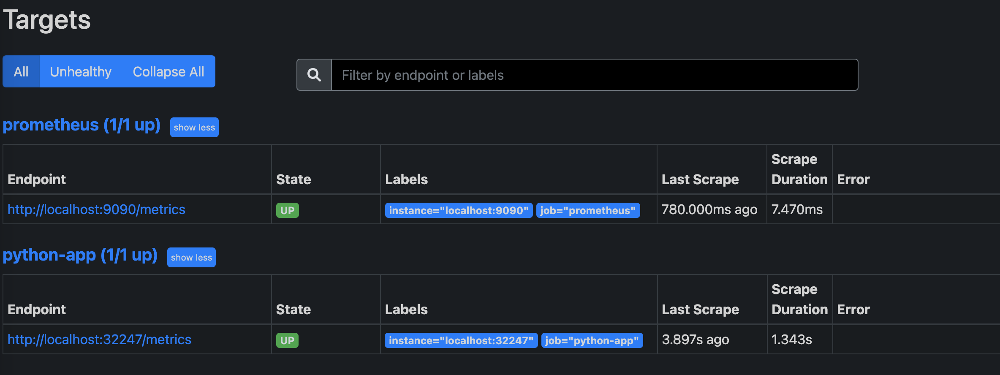
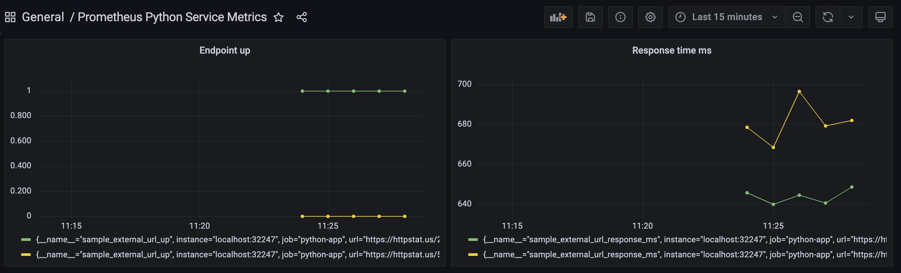

# Simple Python Prometheus Collector

This code spins up a simple python server to call 2 endpoints:
1) `https://httpstat.us/503`
2) `https://httpstat.us/200`

The result of calling these endpoints is then published to Prometheus containing:
1) The response in milliseconds.
2) Either `0` or `1` depending on the http status code.

### Prerequisites
Run `pip install -r requirements.txt`. Then, before building any docker images using
the provided Dockerfile, be sure to run the test suite by running `python -m pytest tests`.

### How-to Run
There is a Dockerfile contained in this repo which can be built and should be
tagged as `prom-py:0.1`. This is important since the tag is used as part of the 
kubernetes deployment.
* `docker build -t prom-py:0.1 .`

Once the docker image is built and tagged correctly, all that needs to be run is `kubectl apply -f monitoring_cluster.yaml`.
This will run a single replica deployment and a service to allow the Prometheus application
to scrap the `/metrics` endpoint.

### Screenshot of running
* Prometheus Service


My Prometheus configuration, the port for the `python-app` can be found by running `kubectl get svc` and copying the port for the `prometheus-py` service.
```
scrape_configs:
  - job_name: "prometheus"
    static_configs:
    - targets: ["localhost:9090"]
  - job_name: "python-app"
    static_configs:
    - targets: ["localhost:32247"]
```

* Grafana Dashboard screenshot
